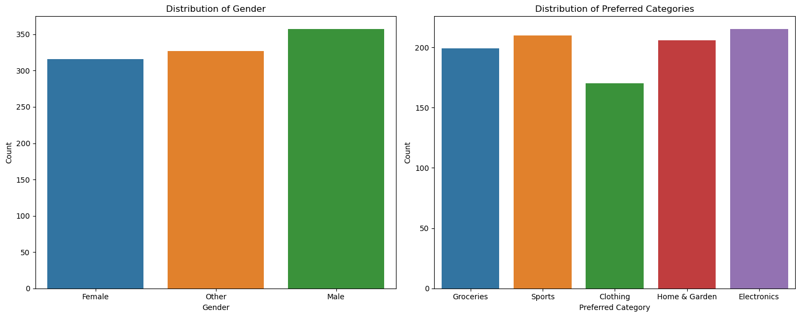
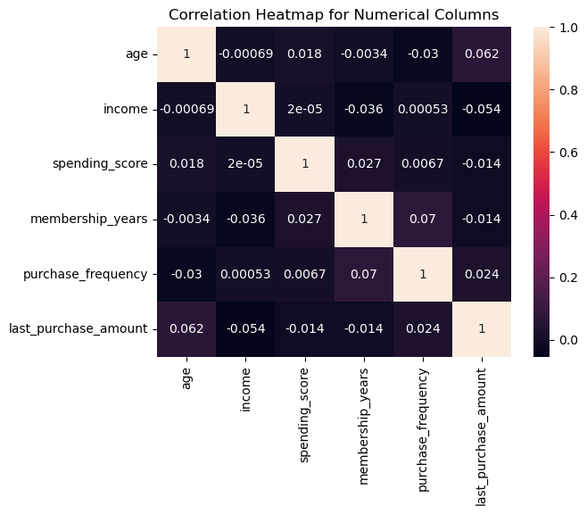
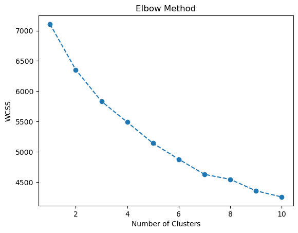
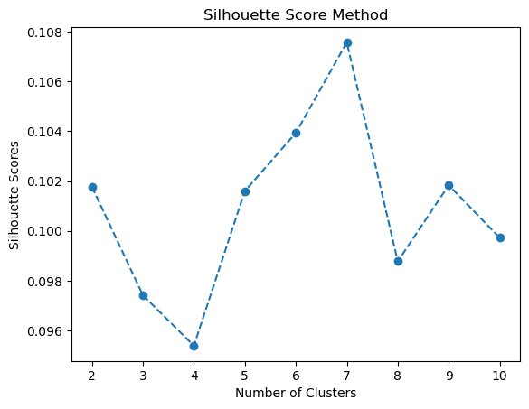
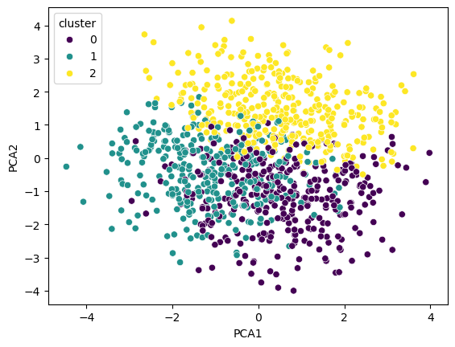
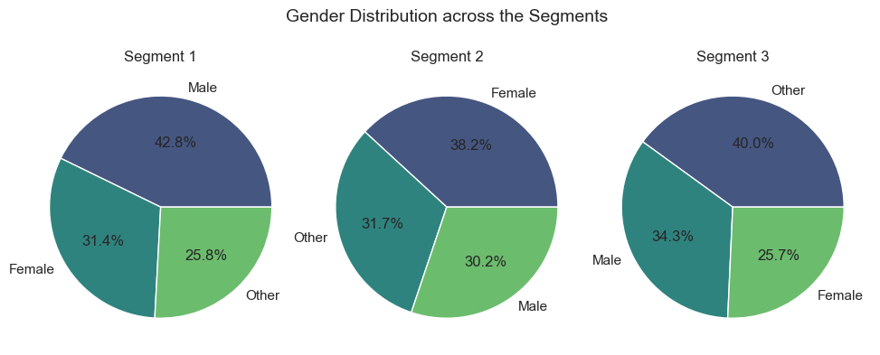
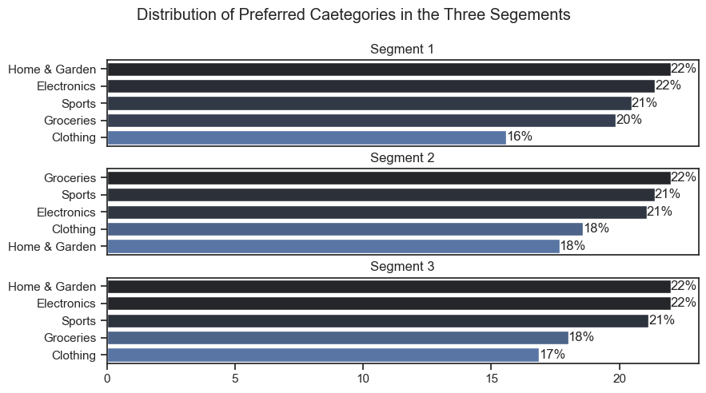

# Customer Segmentation in Marketing Analysis

# Introduction

As a Data Analyst in the marketing domain, understanding customer behavior and tailoring marketing strategies accordingly is key to maximizing customer engagement and boosting sales. This project leverages KMeans clustering, a powerful machine learning technique, to segment customers into distinct groups based on their characteristics and behaviors. By clustering customers with similar attributes, businesses can identify valuable insights, enabling more personalized and effective marketing campaigns.

The dataset used in this project is sourced from Kaggle 
[Customer Segmentation Data
](https://www.kaggle.com/datasets/fahmidachowdhury/customer-segmentation-data-for-marketing-analysis) and includes key customer features such as age, gender, annual income, spending behavior, and purchase history. By applying KMeans clustering, we gain insights into customer segments that can inform better decision-making, targeted campaigns, and optimized customer retention strategies.


# Where can this analysis be used

1. Customer Segmentation : Identify distinct customer groups based on age, income, spending behavior, and preferences. Use these segments to understand customer diversity and create personalized experiences.

2. Targeted Marketing :Craft tailored marketing strategies for each segment, such as exclusive offers for high-value customers or promotions targeting specific age groups or preferred categories.

3. Product Recommendations : Leverage segmentation to provide personalized product recommendations, increasing the likelihood of cross-selling and upselling opportunities.

4. Churn Prediction and Prevention : Identify segments at risk of disengagement and implement targeted strategies, such as re-engagement campaigns or special incentives, to reduce churn.

5. Enhancing Customer Experience : Tailor communication, offers, and service levels based on segment-specific needs, leading to higher satisfaction and improved brand loyalty.

# Tools I Used

For my deep dive into the customer segmentation analysis, I harnessed the power of several key tools:

- **Python:** The backbone of my analysis, allowing me to analyze the data and find critical insights.I also used the following Python libraries:
    - **Pandas Library:** This was used to analyze the data. 
    - **Matplotlib Library:** I visualized the data.
    - **Seaborn Library:** Helped me create more advanced 
    visuals. 
    - **Scikit learn Library**Used to train the data to get clusters using Kmeans
- **Jupyter Notebooks:** The tool I used to run my Python scripts which let me easily include my notes and analysis.
- **Visual Studio Code:** My go-to for executing my Python scripts.
- **Git & GitHub:** Essential for version control and sharing my Python code and analysis, ensuring collaboration and project tracking.

# Data Preparation and EDA 

This section outlines the steps taken to prepare the data for analysis, ensuring accuracy and usability. The notebook with detailed steps here: [Exploratory Data Analysis](EDA.ipynb)

## Import & Clean Up Data

I start by importing necessary libraries and loading the dataset, followed by initial data cleaning tasks to ensure data quality.

```python
#importing libraries

import pandas as pd
import numpy as np
import seaborn as sns
import matplotlib.pyplot as plt
from sklearn.preprocessing import StandardScaler

# Loading Data

df = pd.read_csv("C:/Users/admin/Desktop/Portfolio projects/Project_marketing/dataset/customer_segmentation_data.csv", index_col= 'id')

```   
     
## Exploratory Data Analysis

To understand the structure and content of the dataset, I did the following steps :

1. Use the describe() to get the summary statistics 

```python
df.describe()
```


From this , we could see that there is no missing values in this data. 

2. Check for duplicates using 
``` python 
df.duplicated().sum()
```
There were no duplicates found in the dataset

3. Exploring the data through visualizations to understand the relation between the different variables

### Spending vs Gender

*Bar chart showing the spending vs gender score.*

### Distribution Graphs

```python
    #Distribution of gender and preferred catoegory

    cat_features = ['gender','preferred_catorgory']

    #plotting
    fig, ax = plt.subplots(1, 2,figsize=(15,6))

    sns.countplot(x='gender', data=df, ax=ax[0], hue='gender')
    ax[0].set_title('Distribution of Gender')
    ax[0].set_xlabel('Gender')
    ax[0].set_ylabel('Count')


    sns.countplot(data=df,x='preferred_category',ax=ax[1],hue='preferred_category')
    ax[1].set_title('Distribution of Preferred Categories')
    ax[1].set_xlabel('Preferred Category')
    ax[1].set_ylabel('Count')

    plt.tight_layout()
    plt.show()

```
    
 *Plot showing the distributions of gender and preferred category in the data.*

Observations:

1. Distribution of Gender is more or less similar with Male having the most count in data
2. In preferred categories, clothing seems to be less favoured while electronics and sports are the most preferred

### Correlation graph 

*Correlation between the numerical features*


## Data preprocessing

This encompasses data cleaning and tranformations such as normalizations, scslaing , categorical variable encoding , and feature engineering. This makes the data ready for analytical insights and model building.

### Scaling of Numerical values

In this data, the values have different scales. For building the model , scaled features helps to coverage faster and prevents featured with large scales from dominating smaller scales.

```python
#scaling
scaler = StandardScaler()
scaled_data = scaler.fit_transform(col_data)
scaled_df = pd.DataFrame(scaled_data, columns=num_features)
scaled_df.index = df.index

#replace original columns 
df[num_features] = scaled_df
```
## Encoding of categorical variables 

Here I did one hot encoding to convert the categorical variables into binary vectors True or False. This is done to make the categorical data ready for the training

```python
#categorical encoding 
df = pd.get_dummies(df, columns=['gender','preferred_category'], drop_first=True)
```

# Kmeans model training for Segmentation

Using K-means clustering, we segment customers. Steps include:

1. Determine Optimal Number of Clusters: Use the Elbow Method & Silhouette score method
2. Apply K-means Clustering: Initialize and fit the model with the optimal number of clusters

View my notebook with detailed steps here: [Kmeans model Training for Segmentation](Kmeans_model.ipynb).

## Choosing the number of clusters

Use elbow method and silhouette score to determine the optimal number of clusters

```python
#elbow method

wcss =[]

for i in range(1,11):
    kmeans = KMeans(n_clusters=i,init='k-means++',random_state=42)
    kmeans.fit(df_new)
    wcss.append(kmeans.inertia_)
```


From elbow graph, it shows k to be 4 or 5 . Will decide after the silhouette score method

```python
#silhouette scores to validate the no of clusters

silhouette_scores = []

for k in range(2,11):
    kmeans = KMeans(n_clusters=k,random_state=42)
    kmeans.fit(df_new)
    score = silhouette_score(df_new,kmeans.labels_)
    silhouette_scores.append(score)
```

number of clusters by silhouette score is seen to be 7 to be optimal

So, I will be using k = 5

## Model Training and Visualizations

Here , I will use the KMeans clustering model with the chosen number of clusters = 5 and visualize it

```python
#Choose k=5 based on elbow method and silhouette score method
kmeans = KMeans(n_clusters=5, random_state=42)
kmeans.fit(df_new)
```

Now, i will use PCA to visualize the clusters. I did PCA with three components and once again train the model using k=3 clusters after few trials and errors. 
```python
#visualizing cluster using PCA to 2 components

pca = PCA(n_components=2, random_state=42)
pca_components = pca.fit_transform(df_new.drop('cluster',axis=1,errors='ignore'))

#add PCA componenets to data frame
df_new['PCA1'] = pca_components[:,0]
df_new['PCA2'] = pca_components[:,1]

#Initialize Kmeans with k=3 clusters after trials and errors
kmeans = KMeans(n_clusters=3, random_state=42)
labels = kmeans.fit_predict(df_new.drop(['cluster','PCA1','PCA2'],axis=1,errors='ignore'))

#visualize
sns.scatterplot(data=df_new,x='PCA1', y='PCA2', hue='cluster',palette='viridis')
```


## Interpreting & Visualizing Cluster Profiles 

Profiling each segment to understand their unique traits and behaviors. Visualizing of clusters is done to gain further insights

### 1. *Visualizing Age, Purchase Frequency & Last purchase Amount  Distribution in Each Cluster*


Here we can see that the three clusters show some unique traits which could help us in the business iniatives.

### 2. *Gender Distribution Across the Segments*


Here we can see that each segment has a unique gender .
### 3. *Distribution of Preferred Categories*


1. Home Garden & Electronics are the preferred categories in segment 1 which is also male dominated
2. Groceries are the preferred categories in segment 2 which is female dominated
3. Again home & garden and electronics are the preferred categories in segment 3 where the other gender dominates

In the three profiles , clothing is not a very preferred category.

## Cluster characteristics & Recommendations

### Segment 1 

- Gender : **Male**
- Average Age : **30**
- Most Preferred Category : Home & Garden , Electronics
- Average Income: **$90.8K**
- Purchase Frequency : **37**
- Low spending score : 43 

*Recommendations* : 

1.  Focus on Home Garden and Electronics promotions & personalized ads targeting males around the late 20s to early 30s ( tech savy) with medium to high income .
2. Implement points based programs and send emails rewarding frequent purchases and further engagement.


### Segment 2 

- Gender : **Female**
- Average Age : **48**
- Most Preferred Category : Groceries
- Average Income: **$97.6K**
- Purchase Frequency : **18**
- Average spending score : 55

*Recommendations* 
1. Diversify grocery product offerings including premium products to cater to this group having a moderate  spending score but higher income
2. To increase their purchase frequency, develop strategies such as same day delivery or subscription plans
3. Highlight products that resonate with this age group, such as health-focused or family-oriented groceries.

### Segment 3

- Gender : **Others**
- Average Age : **56**
- Most Preferred Category : Home & Garden , Electronics
- Average Income: **$77.9K**
- Purchase Frequency : **27**
- Average spending score : 54

*Recommendations* 
1. Offer bundled deals combining Home & Garden and Electronics products, paired with incentives like free installation or extended warrantie
2. Create a loyalty program that rewards frequent purchases with discounts, exclusive deals, or added perks like free delivery or extended warranties.
3. Develop engaging DIY tutorials and how-to guides to highlight product functionality and encourage informed purchases.

# What I Learned

Throughout this project, I deepened my understanding of the customer segmentaion in marketing and enhanced my technical skills in Python, especially in data manipulation, visualization and training unsupervised models using KMeans. Here are a few specific things I learned:

- **Advanced Python Usage**: Utilizing libraries such as Pandas for data manipulation, Seaborn and Matplotlib for data visualization, and Scikit-learn for KMeans  helped me perform complex data analysis tasks more efficiently.
- **Gaining insights from Segmentation**: I gained an understanding of how to group customers based on demographics and behaviours to identify actionable patterns.
- **Practical Applications**: Learned how customer segmentation can inform marketing strategies like targeted campaigns and loyalty programs, translating data into actionable business insights.


# Insights

This project provided several general insights from segmenting customers 

- **Customer Demographics & Behaviours** :Customer demographics and behavioral data, such as income and spending scores, are crucial in understanding market segments.
- **Marketing analysis**:The alignment of marketing strategies with customer preferences (e.g., preferred categories) leads to better engagement and retention.
- **Optimization of resources**: Segmentation enables resource optimization by focusing efforts on high-potential customer groups.

# Challenges 

- **Data Imbalance**: Some demographic groups were underrepresented, impacting the fairness of the segmentation.
- **Choosing the Right Number of Clusters**: Deciding the optimal number of customer segments required multiple iterations and trials &b errors using the elbow method and silhouette scores.

# Conclusion

Customer segmentation plays a key role in helping businesses gain valuable insights into their customer base and tailor their offerings to meet specific needs. With the power of machine learning, businesses can uncover patterns and trends that traditional methods may miss. This project underscores the importance of using data-driven approaches to inform decision-making, allowing for more effective marketing strategies and a higher level of customer satisfaction.


